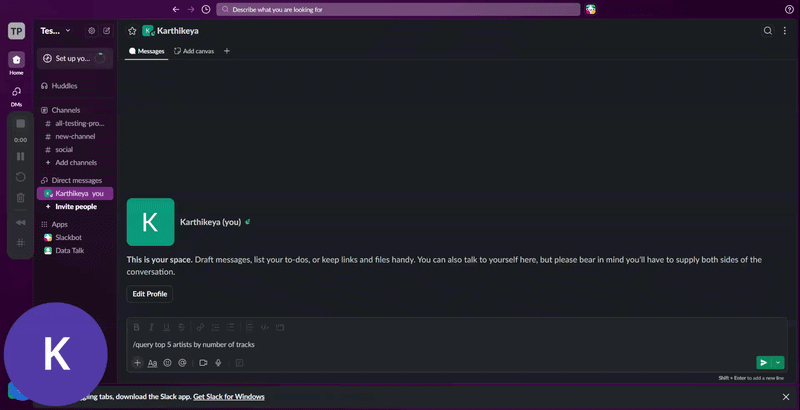

# DataTalk — NL2SQL Analytics Platform

> 🔌 Connect your PostgreSQL database directly to Slack and query it in plain English with `/query`

Built for non-technical users — HR managers, finance teams, and business analysts who sit on valuable data but can't write SQL to get insights from it.

---

## Live Demo

🌐 Try the Web App: https://nl2sql-analytics-platform.streamlit.app/
---

## Demo

### Slack Bot


---

## What makes this different

Most NL2SQL tools assume a clean, well-designed database. Real-world databases are messy — foreign keys aren't always defined, column names are inconsistent, schemas are incomplete.

DataTalk handles both:

- **Well-designed DB** — reads FK relationships directly from `information_schema`. Zero configuration needed.
- **Messy DB or CSV files** — auto-detects relationships using sentence transformer embeddings + DBSCAN clustering. No manual threshold setting, no sliders, fully automatic.

And after every query, it explains the result in plain English — so non-technical users understand what they're looking at, not just see a table of numbers.

---

## Features

- 🔌 Connect to PostgreSQL, MySQL, SQLite via URI
- 📁 Upload CSV or Excel files directly
- 🔍 Auto-detects table relationships — works even without foreign keys defined
- 🤖 Generates accurate SQL using Groq LLaMA 3.3 70B
- 💬 Explains every query in plain English
- 💼 Slack bot — query your database with `/query` directly from Slack
- 🔒 Only SELECT queries allowed — no data modification possible
- 🧹 Zero data persistence — all processing in memory

---

## How it works

```
User asks question in plain English
↓
App connects to DB or reads uploaded files
↓
Auto-extracts schema from information_schema (DB mode)
or reads CSV headers (upload mode)
↓
Detects table relationships:
  → FK constraints found? Use them directly
  → No FKs? Fall back to embedding-based DBSCAN detection
↓
Builds context-aware prompt with schema + relationships
↓
Groq LLaMA 3.3 70B generates SQL
↓
SQL executes on DuckDB / PostgreSQL
↓
Results returned + plain English explanation generated
```

---

## Tech Stack

| Layer | Technology |
|-------|-----------|
| UI | Streamlit |
| Slack Bot | Slack Bolt + FastAPI |
| LLM | Groq API (LLaMA 3.3 70B) |
| Embeddings | Sentence Transformers |
| Similarity Search | FAISS + DBSCAN |
| DB Connection | SQLAlchemy + psycopg2 |
| Query Execution | DuckDB |
| Data Processing | Pandas |

---

## Project Structure

```
nl2sql/
├── prompts/
│   ├── sql_generation.txt           # SQL generation system prompt
│   ├── query_explanation.txt        # Plain English explanation prompt
│   └── relationship_validation.txt
├── app.py                           # Streamlit UI and main flow
├── db_connector.py                  # PostgreSQL connection + schema extraction
├── schema.py                        # Schema extraction from CSV/Excel
├── matching.py                      # Auto relationship detection
├── prompt.py                        # Dynamic prompt builder
├── query.py                         # SQL validation and execution
├── llm.py                           # Groq API wrapper
├── slack_bot.py                     # Slack bot with /query command
├── .env                             # API keys (never committed)
└── requirements.txt
```

---

## Setup

### 1. Clone the repo
```bash
git clone https://github.com/Karthikeya2302/nl2sql-analytics-platform.git
cd nl2sql-analytics-platform
```

### 2. Install dependencies
```bash
pip install -r requirements.txt
```

### 3. Set environment variables
Create a `.env` file:
```
GROQ_API_KEY=your_groq_api_key_here
GROQ_MODEL=llama-3.3-70b-versatile
DATATALK_DB_URI=your_postgres_uri_here
SLACK_BOT_TOKEN=your_slack_bot_token
SLACK_SIGNING_SECRET=your_signing_secret
```

### 4. Run the web app
```bash
streamlit run app.py
```

### 5. Run the Slack bot (optional)
```bash
uvicorn slack_bot:api --port 3000
```
Expose port 3000 using ngrok or VS Code port forwarding and update your Slack app's slash command URL to:
```
https://your-public-url/slack/events
```

---

## Example Questions

**Single table**
- "show me all artists"
- "how many customers are there"
- "show me top 10 tracks by length"

**Multi-table JOINs**
- "top 5 artists by number of tracks"
- "which customer spent the most money"
- "total sales by country"
- "show me all invoices with customer names"

---

## Limitations

- Relationship detection works best when column names follow consistent naming conventions (e.g. `customer_id`, `order_id`). Completely different names for the same concept may be missed.
- Designed for structured tabular data only
- Date calculations may need explicit type casting depending on how dates are stored in your database
- Slack bot requires local server + port forwarding for demo; deploy to Railway or Render for permanent hosting

---


## Author

Built by Karthikeya Thimirishetty — MS CS at UAB


